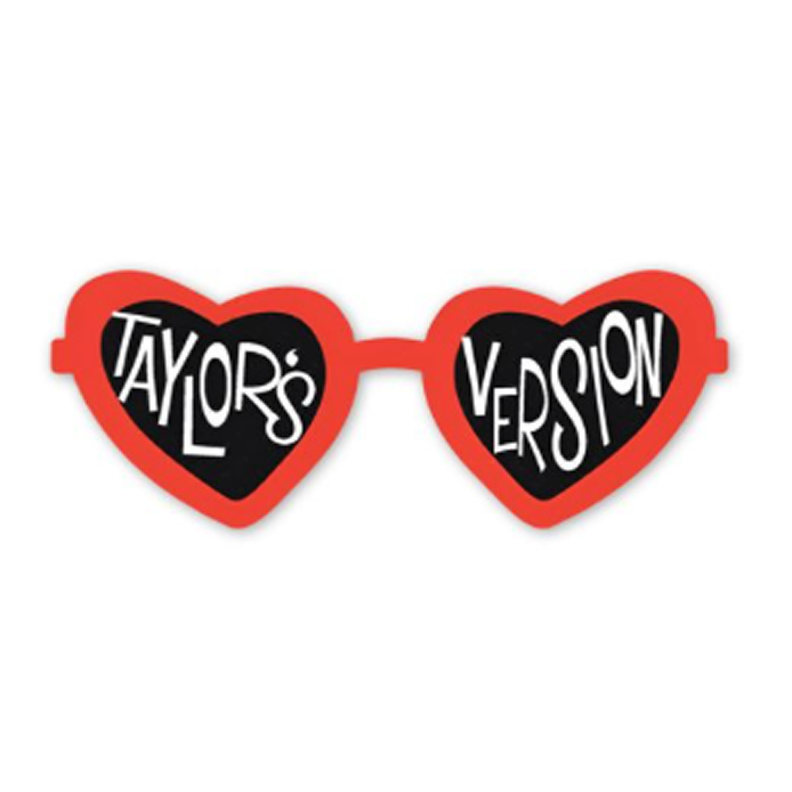

<div align="center">



# Swift Expression

### Your feelings, in Taylor's Version. 💔❤️‍🔥

Point your camera at a face, let on-device machine learning read the emotion, and
get a **Taylor Swift song** — with its lyrics — that matches exactly how you feel.

<br/>

[](https://www.apple.com/ios/)
[](https://swift.org)
[](https://developer.apple.com/xcode/swiftui/)
[](https://developer.apple.com/documentation/coreml)
[](LICENSE)

</div>

---

## 📑 Table of Contents

- [About](#-about)
- [How It Works](#-how-it-works)
- [Emotions → Songs](#-emotions--songs)
- [Features](#-features)
- [Tech Stack](#-tech-stack)
- [Project Structure](#-project-structure)
- [Getting Started](#-getting-started)
- [Authors](#-authors)

---

## ✨ About

**Swift Expression** is an iOS app that reads the **feeling** from a person's photo
using a trained Core ML image-classification model, then hands you back a Taylor
Swift song — and its lyrics — that fits the mood. Sad? Happy? In love? There's a
song for that. 🎤

Everything runs **on-device** with Core ML + Vision — no servers, no uploads.

---

## 🧠 How It Works

The emotion-detection pipeline lives in `CoreMLViewModel.swift`:

```swift
func checkImage(_ image: UIImage) -> String {
    // 1. UIImage → CIImage
    guard let ciImage = CIImage(image: image) else { ... }

    // 2. Load the trained model wrapped for Vision
    let config = MLModelConfiguration()
    let model = try VNCoreMLModel(for: FacialExpressions(configuration: config).model)

    // 3. Run a Vision classification request
    let request = VNCoreMLRequest(model: model) { request, _ in
        if let results = request.results as? [VNClassificationObservation] {
            classificationLabel = results.first!.identifier   // e.g. "happy"
        }
    }

    // 4. Perform the request on the image and return the top label
    try VNImageRequestHandler(ciImage: ciImage).perform([request])
    return classificationLabel
}
```

The returned label is matched in `ResultPage.swift` against a song dictionary in
`Songs.swift` to pick the perfect track and its lyrics.

---

## 🎭 Emotions → Songs

The `FacialExpressions` Core ML model classifies five emotions, each mapped to a
curated set of Taylor Swift songs:

<div align="center">

| Emotion | Vibe |
|:---:|:---|
| 😀 `happy` | Upbeat, feel-good anthems |
| 😢 `sad` | Heartbreak ballads |
| 😡 `angry` | Fierce, get-it-out tracks |
| 😨 `fear` | Tense, vulnerable songs |
| 🥰 `love` | Romantic, lovestruck hits |

</div>

---

## 🚀 Features

- 📸 **Photo-based emotion detection** powered by a trained Core ML model
- 🎶 **Taylor Swift song matching** with full lyrics for each feeling
- 📜 **Lyrics viewer** in a smooth scrollable result page
- 🔒 **100% on-device** — Vision + Core ML, nothing leaves your phone
- 🕶️ **Themed UI** with a custom font and Taylor-inspired maroon palette

---

## 🛠️ Tech Stack

- **Language:** Swift 5
- **UI:** SwiftUI
- **ML:** Core ML + Vision (`FacialExpressions.mlmodel`)
- **Data:** Songs & lyrics from `Songs.swift` / `taylor_lyrics.csv`
- **Minimum target:** iOS 18.0

---

## 📂 Project Structure

```
TaylorExpression/
├── TaylorExpression.xcodeproj        # Xcode project
└── TaylorExpression/
    ├── TaylorExpressionApp.swift     # App entry point
    ├── ContentView.swift             # Home screen (title + start button)
    ├── LoadingView.swift             # Loading / transition screen
    ├── ResultPage.swift              # Emotion, photo, matched song & lyrics
    ├── CoreMLViewModel.swift         # Core ML + Vision emotion classifier
    ├── Songs.swift                   # Songs & lyrics grouped by feeling
    ├── taylor_lyrics.csv             # Raw lyrics dataset
    ├── FacialExpressions.mlmodel     # Trained image-classification model
    ├── Satisfaction.ttf              # Custom display font
    └── Assets.xcassets               # App icon & colors
```

---

## 🎯 Getting Started

**Requirements:** macOS with Xcode 16+ and an iOS 18 simulator or device with a camera.

```bash
# Clone the repository
git clone https://github.com/EnzoFerroni/SwiftExpressions.git

# Open the Xcode project
cd SwiftExpressions
open TaylorExpression/TaylorExpression.xcodeproj
```

Then hit **⌘R** to build and run.

---

## 👥 Authors

<div align="center">
  <table>
    <tr>
      <td align="center">
        <a href="https://github.com/camilatoniato" target="_blank"></a>
        <a href="https://www.linkedin.com/in/camila-ruiz-toniato-91a926301/" target="_blank"></a>
        <br>Camila Toniato
      </td>
      <td align="center">
        <a href="https://github.com/EnzoFerroni" target="_blank"></a>
        <a href="https://www.linkedin.com/in/enzoferroni/" target="_blank"></a>
        <br>Enzo Ferroni
      </td>
      <td align="center">
        <a href="https://github.com/7uigi" target="_blank"></a>
        <a href="https://www.linkedin.com/in/gustavo-pinotti-a2800435a/" target="_blank"></a>
        <br>Gustavo Pinotti
      </td>
      <td align="center">
        <a href="https://github.com/TamiresMendesS" target="_blank"></a>
        <a href="https://www.linkedin.com/in/tamires-mendes-6006792b7/" target="_blank"></a>
        <br>Tamires Mendes
      </td>
      <td align="center">
        <a href="https://github.com/Thaiscangucu" target="_blank"></a>
        <a href="https://www.linkedin.com/in/thaiscangucu/" target="_blank"></a>
        <br>Thais Canguçu
      </td>
      <td align="center">
        <a href="https://github.com/YasminMSouza" target="_blank"></a>
        <a href="https://www.linkedin.com/in/yasmin-mendes-629a29267/" target="_blank"></a>
        <br>Yasmin Mendes
      </td>
    </tr>
  </table>
</div>

---

<div align="center">

Released under the [MIT License](LICENSE). © 2025 Camila Toniato, Enzo Ferroni, Gustavo Pinotti, Tamires Mendes, Thais Canguçu and Yasmin Mendes.

<sub>Made with 💜 and a lot of Taylor Swift.</sub>

</div>
